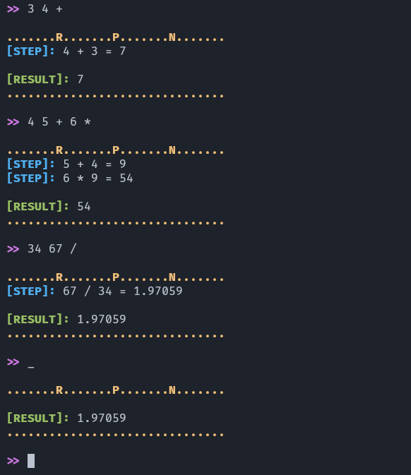

# Simple Math Interpreter
🧮📐 Just simple math interpreter based of [reverse polish notation](https://en.wikipedia.org/wiki/Reverse_Polish_notation)

# Usage
You can use this code like simple calculator

- `a b +` add `a` to `b`
- `a b -` subtract a form `b`
- `a b *` multiplies `b` by `a`
- `a b /` divides `b` by `a`
- `_` return latest calculated value
- `exit` exit from interpreter

## Examples
1. `3 4 +` -> return `7`
2. `3 4 -` -> return `1`
3. `3 4 *` -> return `12`
4. `2 4 /` -> return `2`  
5. `_ _ +` -> return `4` (last value `2`, `2 + 2 = 4`)
